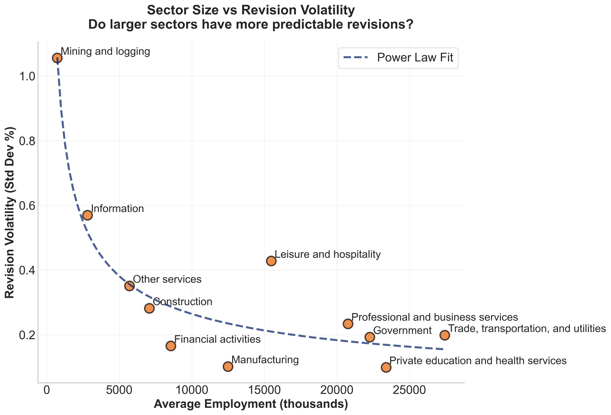
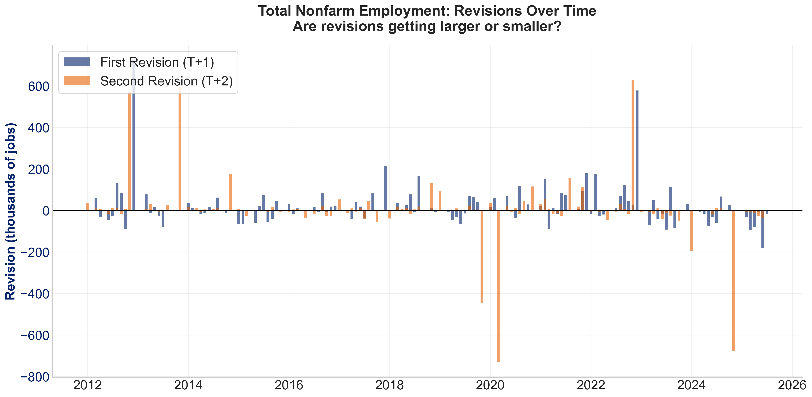
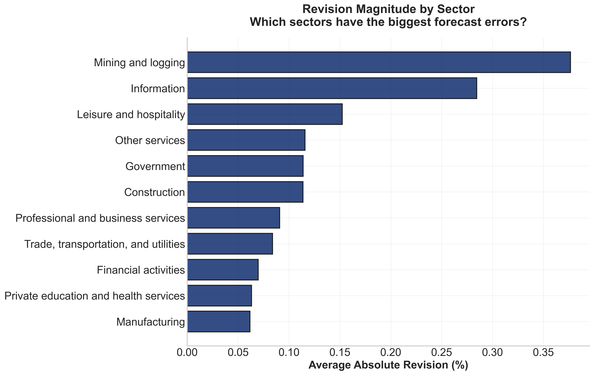
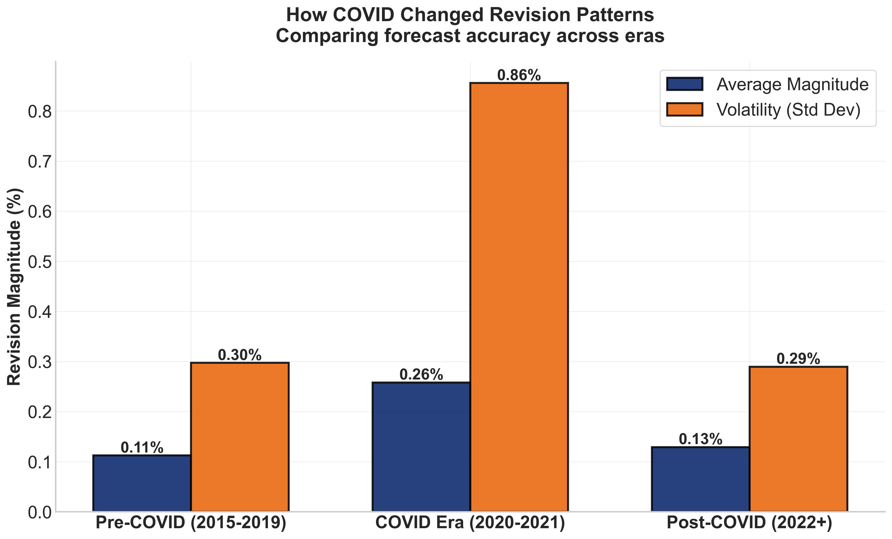
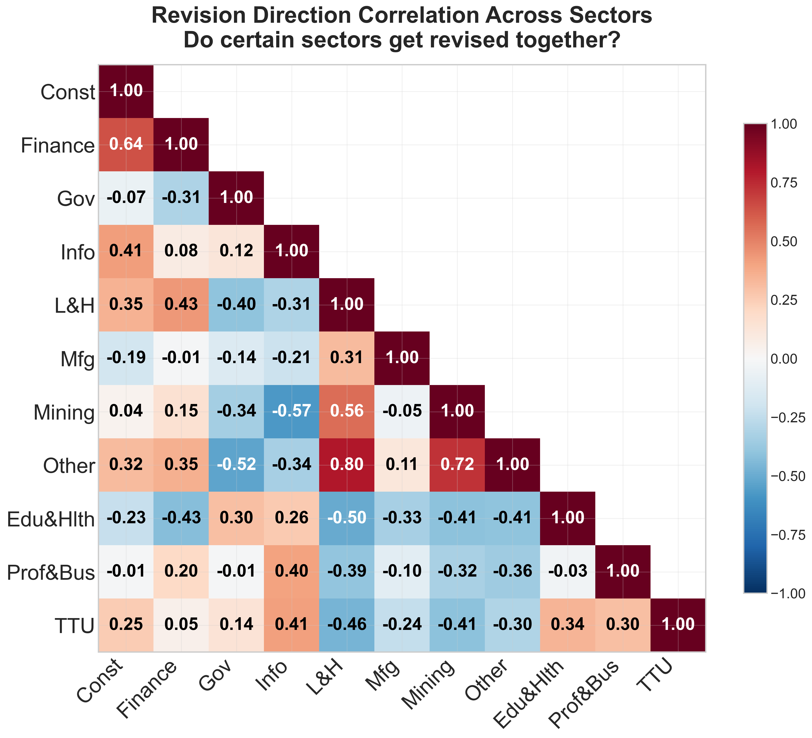

# BLS Employment Revisions Toolkit

> Python toolkit for retrieving BLS employment vintage data from FRED API and calculating revisions across industry hierarchies (2012-present)

## What This Does

The Bureau of Labor Statistics releases preliminary employment figures ~1 week after each month ends, then revises them twice in subsequent monthly releases as more complete survey data becomes available. This toolkit:

1. **Fetches vintage snapshots** from FRED API showing what the data looked like at different points in time
2. **Calculates revisions** by comparing initial estimates (t) against first (t+1) and second (t+2) revisions
3. **Outputs clean datasets** ready for analysis across 50+ industries and multiple hierarchy levels

The result is a comprehensive dataset tracking how employment estimates evolved, enabling analysis of forecast accuracy, systematic biases, and sector-specific volatility.

## Key Features

### Data Collection (`fetch_bls_revisions.py`)
- **Automated industry discovery**: Downloads BLS classification files from public repository, parses tab-delimited format, builds complete mapping of industry codes → NAICS codes → series IDs → hierarchy levels
- **Vintage data retrieval**: Reconstructs historical snapshots by querying FRED's vintage API
- **Intelligent caching**: Deduplicates requests within series to minimize API calls
- **Rate limit handling**: Adaptive delays and exponential backoff for FRED's 120 req/min limit
- **Hierarchical industry support**: Automatically resolves BLS display levels 0-4 (total → supersector → industry → sub-industry) and parent-child relationships
- **Robust error handling**: Tracks failed requests, retries with backoff, validates responses

### Output Dataset Structure
Each row represents one observation month with three estimates:
- `estimate_t`: Initial release (~1 week after month end)
- `estimate_t1`: First revision (1 month later)
- `estimate_t2`: Second revision (2 months later)
- `revision_1month`: t+1 minus t (incremental first revision)
- `revision_2month`: t+2 minus t+1 (incremental second revision)
- `rev2_cum`: t+2 minus t (cumulative total revision from initial to final)
- `rev2_incr`: t+2 minus t+1 (same as revision_2month, explicit alias)
- Percentage versions of all revisions
- Industry metadata (name, supersector, NAICS code, hierarchy level)

### Example Visualizations (`example_visualizations.py`)
18 production-ready charts demonstrating comprehensive analysis capabilities:
- **PAYNSA analysis** (7 charts): Time series, distributions, cumulative revisions, annual patterns
- **Cross-sector comparisons** (8 charts): Net revisions, magnitude, size vs. volatility, correlations, heatmaps, seasonality, COVID impact, directional bias
- **Manufacturing deep dive** (3 charts): Sub-industry net revisions, magnitude, and directional patterns
- **Summary statistics**: Automated CSV export with comprehensive sector metrics 

## Quick Start

### Prerequisites
```bash
pip install pandas requests python-dateutil urllib3
```

Get a free FRED API key: https://fred.stlouisfed.org/docs/api/api_key.html

### Basic Usage

1. **Configure the analysis** in `fetch_bls_revisions.py`:
```python
API_KEY = "your_fred_api_key_here"

RUN_LEVEL_2_ANALYSIS = True       # Broad sectors + total nonfarm
RUN_DETAILED_ANALYSIS = False     # Detailed sub-industries

START_DATE = "2012-01-01"
END_DATE = "2025-07-31"
```

2. **Run data collection**:
```bash
python fetch_bls_revisions.py
```

This generates:
- `bls_revisions_level2_with_paynsa.csv` - Broad sectors + total nonfarm employment
- Progress tracking showing API calls, rate, and cache performance

3. **Analyze detailed sub-industries** (optional):
```python
RUN_DETAILED_ANALYSIS = True
DETAILED_SUPERSECTOR_CODE = "70"  # Leisure & Hospitality
DETAILED_LEVEL = 4                # Finest granularity
```

Common supersector codes:
- `30` = Manufacturing
- `42` = Retail Trade  
- `60` = Professional/Business Services
- `70` = Leisure & Hospitality

4. **Generate example visualizations**:
```bash
python example_visualizations.py
```

This produces:
- 18 PNG charts analyzing revision patterns across sectors and time
- `sector_summary_statistics.csv` with comprehensive sector metrics

Note: Requires `data/bls_revisions_level2_with_paynsa.csv` from step 2. Manufacturing deep dive charts (16-18) are optional and require the detailed manufacturing dataset.

## Understanding BLS Revision Timing

```
Month ends (e.g., January 2024)
    ↓
+7 days: Initial estimate released (t)
    ↓
+1 month: First revision released (t+1)
    ↓
+1 month: Second revision released (t+2)
```

Example for January 2024 employment:
- **t**: Released ~Feb 7, 2024 (initial estimate)
- **t+1**: Released ~Mar 7, 2024 (first revision)
- **t+2**: Released ~Apr 7, 2024 (second revision)

This toolkit retrieves all three vintages for each month and calculates the differences.

## Technical Implementation

### Industry Classification System

The toolkit automatically builds the complete BLS industry universe without requiring manual series ID lists:

1. **Downloads classification file**: Fetches `ce.industry` from BLS's public data repository (https://download.bls.gov/pub/time.series/ce/)
2. **Parses industry metadata**: Extracts industry codes, NAICS codes, names, and hierarchy levels from tab-delimited format
3. **Generates series IDs**: Constructs FRED series IDs using BLS naming convention (CES/CEU + 8-digit code + data type)
4. **Resolves hierarchies**: Maps supersector parent-child relationships (e.g., Manufacturing 30 → Durable 31 + Nondurable 32)

This means you can analyze any industry in the BLS hierarchy without manually maintaining series ID lists - just specify the supersector code and level.

### Optimization Strategies

**Caching**: The toolkit caches API responses using MD5 hashes of request parameters. While cross-series cache hits are rare (each series has unique data), caching prevents duplicate requests within the same series and tracks known failures to avoid retrying bad requests.

**Adaptive Rate Limiting**: Monitors API response times and dynamically adjusts delays. Base delay of 0.5s increases to max 2.0s if the API slows down, preventing rate limit errors while maximizing throughput.

**Efficient Vintage Selection**: Rather than fetching each observation month individually, the toolkit:
1. Calculates all needed vintage dates upfront
2. Uses a consistent extended date range across all API calls
3. Fetches complete time series in each vintage snapshot
4. Extracts relevant data points from each snapshot

This reduces API calls from ~3 per month to ~3 per analysis period.

**Hierarchical Industry Handling**: Automatically resolves parent-child relationships in BLS supersectors. For example, requesting Manufacturing (code 30) automatically includes both Durable Goods (31) and Nondurable Goods (32).

### API Interaction Pattern

```python
# For each observation month, fetch three vintage snapshots:
vintage_t = get_data_as_of_date(series_id, release_date, obs_start, obs_end)
vintage_t1 = get_data_as_of_date(series_id, revision_date_1, obs_start, obs_end)
vintage_t2 = get_data_as_of_date(series_id, revision_date_2, obs_start, obs_end)

# Compare to calculate revisions
revision_1month = vintage_t1[obs_month] - vintage_t[obs_month]  # Incremental first step
revision_2month = vintage_t2[obs_month] - vintage_t1[obs_month]  # Incremental second step
rev2_cum = vintage_t2[obs_month] - vintage_t[obs_month]  # Cumulative total revision
```

## Key Findings from Sample Analysis

Analysis of 2012-2025 data reveals:

1. **First revisions dominate**: The t→t+1 revision accounts for most of the total adjustment. Subsequent t+1→t+2 changes are typically incremental refinements.

2. **Sector heterogeneity**: Leisure & Hospitality shows average revisions exceeding 1% of employment, while utilities and government average under 0.2%. This reflects differences in survey response rates and employment volatility.

3. **Size-volatility relationship**: Larger sectors generally have more predictable revisions (lower % volatility), following a power law. However, Leisure & Hospitality is a notable outlier due to high turnover and part-time employment.

4. **COVID-19 break**: The 2020-2021 period saw 2-3x larger revisions across all sectors, reflecting unprecedented measurement challenges.

5. **Systematic biases**: Some sectors show persistent directional bias - certain industries are consistently revised upward while others trend downward.

See `example_visualizations.py` output for detailed charts and analysis.

## Key Visualizations

The toolkit enables multi-scale analysis from aggregate employment to detailed sub-industries. Selected charts below demonstrate the range of patterns uncovered in the 2012-2025 data.

### Sector Size vs Revision Volatility



Larger sectors generally show lower percentage revision volatility, following an approximate power law. Leisure & Hospitality is a notable outlier—despite its size, it maintains high volatility consistent with measurement challenges in high-turnover industries. Mining and Information, as smaller sectors, show the highest unpredictability.

### Total Nonfarm Employment: Revision History



Monthly revisions typically range ±50-60k jobs for the headline employment figure. The 2020-2021 period shows extreme spikes (±600k) reflecting pandemic-related sampling challenges. Both first (blue) and second (orange) revisions contribute substantially, with recent years showing systematic patterns rather than random noise.

### Revision Magnitude by Sector



Forecast errors vary dramatically across industries. Mining and Information average 0.30-0.35% revisions, while Manufacturing averages just 0.05%—a 7x difference. This likely reflects both response rate differences and intrinsic employment volatility in each sector.

### COVID's Impact on Measurement Quality



The pandemic period (2020-2021) saw revision magnitudes increase 2.4x and volatility increase 3x versus pre/post periods. This quantifies the measurement crisis during lockdowns and rapid sectoral shifts. The post-2022 recovery suggests data collection has largely stabilized, though volatility remains elevated.

### Cross-Sector Revision Correlations



Strong positive correlations (Construction ↔ Finance: 0.64, Leisure ↔ Other Services: 0.80) suggest common response timing or economic linkages. Negative correlations (Leisure ↔ Government: -0.40, Mining ↔ Information: -0.57) indicate sectors face distinct measurement challenges or counter-cyclical patterns.

---

**For complete analysis including distributions, time series, manufacturing sub-industry breakdowns, and 13 additional charts, see [VISUALIZATIONS.md](VISUALIZATIONS.md)**

## File Structure

```
bls-employment-revisions-analysis/
├── README.md
├── fetch_bls_revisions.py          # Main data collection
├── example_visualizations.py        # Sample analysis charts
├── requirements.txt
├── .gitignore
├── data/
│   ├── README.md                    # Data generation instructions
│   ├── bls_revisions_level2_with_paynsa.csv          # Required for visualizations
│   └── bls_revisions_level4_30_Manufacturing.csv     # Optional, for manufacturing charts
└── output/
    ├── sector_summary_statistics.csv  # Automated metrics export
    └── [18 generated PNG charts]
```

## Output Files

**Level 2 Analysis** (`bls_revisions_level2_with_paynsa.csv`):
- Broad industry sectors (Manufacturing, Retail, Healthcare, etc.)
- Total nonfarm employment (PAYNSA series)
- ~2,000 observation-months per sector (2012-2025)

**Detailed Analysis** (e.g., `bls_revisions_level4_70_Leisure_and_hospitality.csv`):
- Sub-industries within a specific supersector
- Granular breakdowns (e.g., "Food services and drinking places")
- Same time range, more detailed industry splits

**Summary Statistics** (`sector_summary_statistics.csv`):
- Comprehensive metrics for all level 2 sectors plus PAYNSA: mean, std dev, absolute revisions (levels and percentages)
- Generated automatically when running `example_visualizations.py`
- Includes both 1-month and 2-month revision statistics
- One row per broad industry sector (Manufacturing, Retail, Healthcare, etc.)

## Configuration Options

### Analysis Scope
```python
RUN_LEVEL_2_ANALYSIS = True      # Broad sectors
RUN_DETAILED_ANALYSIS = True     # Detailed sub-industries
```

### Detailed Analysis Parameters
```python
DETAILED_SUPERSECTOR_CODE = "70"  # Which supersector to analyze
DETAILED_LEVEL = 4                # Hierarchy depth (3 or 4 typical)
```

### Date Range
```python
START_DATE = "2012-01-01"
END_DATE = "2025-07-31"
```

Note: FRED vintage data availability varies by series. The toolkit handles missing data gracefully.

## Performance Characteristics

Typical run (Level 2 + one detailed supersector):
- **API calls**: 800-1,500 depending on date range and industry count
- **Runtime**: 15-30 minutes with adaptive rate limiting
- **Cache hit rate**: 10-20% (primarily within-series deduplication)
- **Output size**: 50-200 MB uncompressed CSV

## Extending the Toolkit

### Adding New Industries
Modify the supersector code in configuration:
```python
DETAILED_SUPERSECTOR_CODE = "30"  # Manufacturing
DETAILED_LEVEL = 4
```

### Analyzing Different Hierarchy Levels
The BLS uses display levels 0-4:
- Level 0: Total nonfarm
- Level 1: Major aggregates (goods-producing, service-providing)
- Level 2: Supersectors (Manufacturing, Retail, Healthcare)
- Level 3: Industry groups
- Level 4: Detailed industries

Adjust `DETAILED_LEVEL` to change granularity.

### Custom Revision Windows
The code can be modified to calculate longer revision windows (e.g., t→t+12 for annual benchmark revisions) by adjusting vintage date calculations in `_calculate_vintage_dates_optimized()`.

## Data Quality Notes

- **Missing values**: Some series have gaps due to suppression (small sample sizes) or late reporting
- **Seasonal adjustment**: This toolkit uses NSA (not seasonally adjusted) series for consistency
- **Benchmark revisions**: Annual benchmark revisions (beyond t+2) are not captured in this analysis
- **Industry reclassification**: NAICS code changes over time may affect comparability for some detailed industries

## Use Cases

This dataset enables analysis of:
- Forecast accuracy by sector and time period
- Systematic over/underestimation patterns
- Impact of economic shocks (COVID-19) on measurement quality
- Relationship between industry characteristics and revision volatility
- Optimal forecast adjustment strategies
- Policy implications of preliminary data reliability

## Requirements

- Python 3.7+
- pandas, requests, python-dateutil, urllib3
- FRED API key (free, instant approval)
- Internet connection for API calls
- ~500MB disk space for output files

## License

MIT License - free for academic, commercial, and personal use.

## Technical Notes

**Why vintages matter**: Standard FRED queries return the "latest available" data, which includes all revisions. Vintage queries return data "as it existed on a specific date," allowing reconstruction of what analysts saw in real-time before revisions occurred.

**API efficiency**: FRED allows batch queries by date range, but requires separate calls for each vintage date. This toolkit minimizes calls by fetching extended date ranges in each vintage snapshot rather than querying month-by-month.

**Series ID format**: BLS uses prefixes to indicate adjustment status:
- `CES` = Current Employment Statistics, Seasonally Adjusted
- `CEU` = Current Employment Statistics, Not Seasonally Adjusted
- This toolkit uses `CEU` (NSA) for revision analysis to avoid seasonal adjustment revisions
