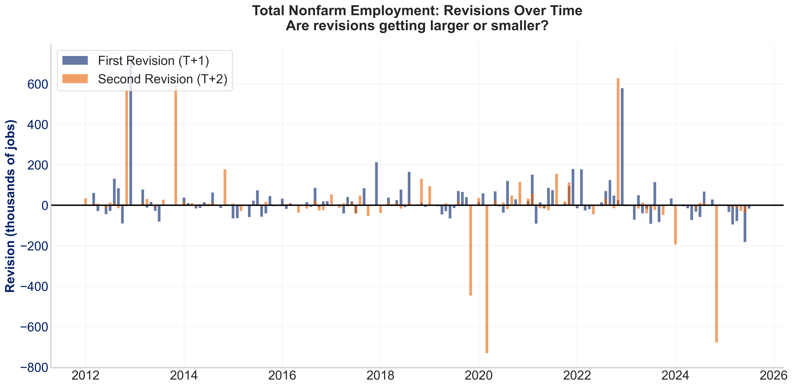
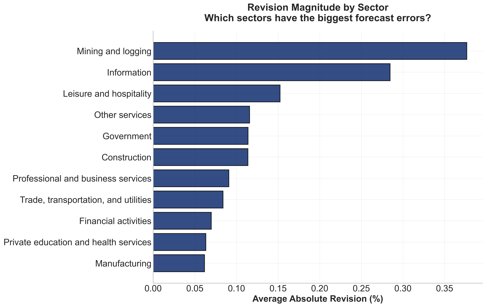
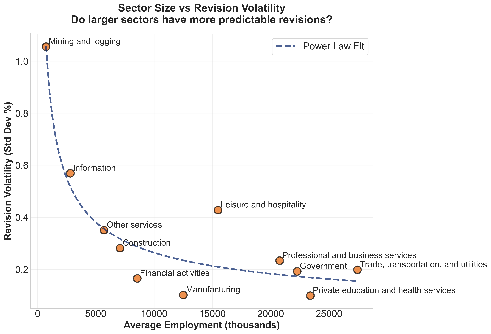
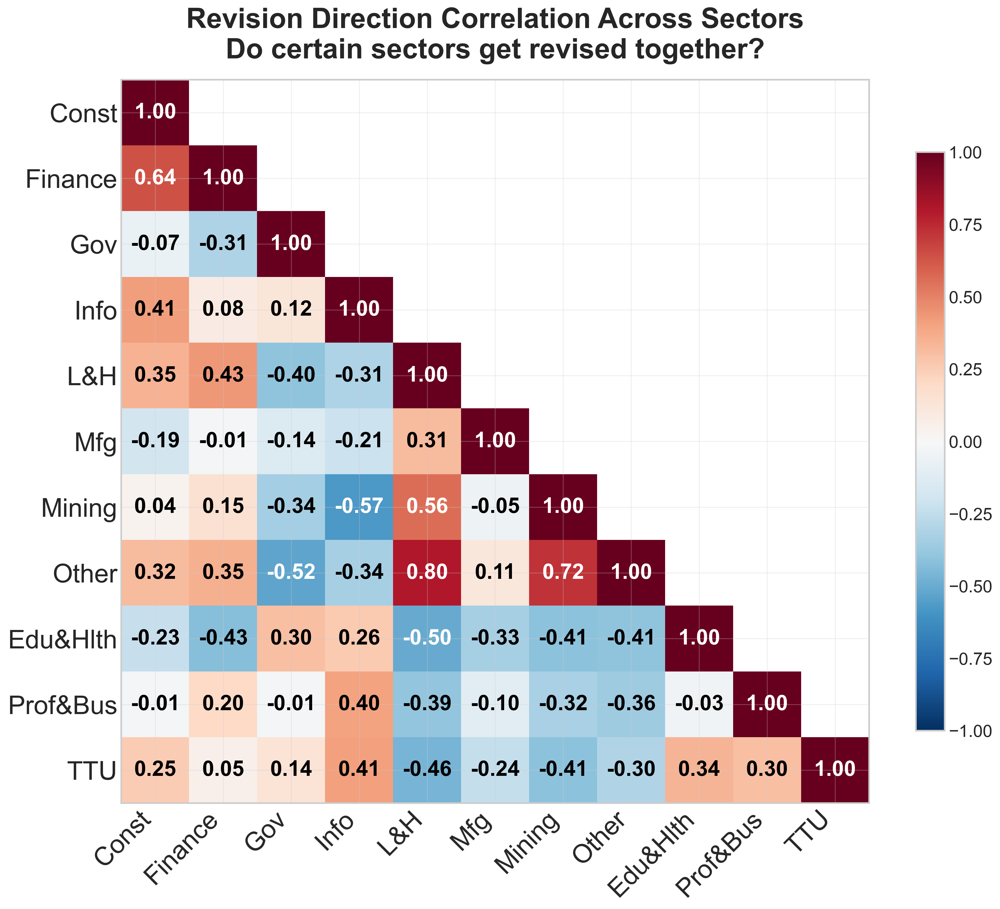
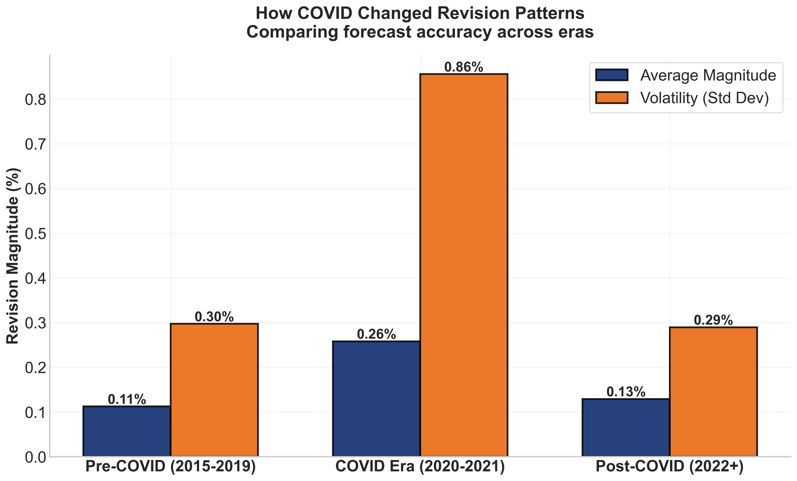

# BLS Employment Revisions: Complete Visualization Portfolio

**Full analysis of revision patterns across 2012-2025**

This document presents all 18 charts generated by `example_visualizations.py`, organized from aggregate to detailed industry analysis.

---

## Section 1: Total Nonfarm Employment (PAYNSA)

Analysis of the headline employment figure used in policy discussions and market reactions.

### Chart 1: Monthly Revisions Over Time

First revisions (T+1, blue) and second revisions (T+2, orange) for each month. Typical revisions range ±50-60k jobs during stable periods. The data shows two distinct episodes of extreme volatility: 2013 with revisions reaching ~600k, and 2020-2023 with revisions ranging from -750k to +600k. The relatively stable 2015-2019 period between these episodes shows substantially smaller revisions.

### Chart 2: Cumulative Net Revisions

Running sum of all revisions over time. Shows periods of systematic underestimation (rising trend, 2021-2023) and overestimation (falling trend, 2024-2025). First revisions (blue) and second revisions (orange) track separately to show which revision cycle contributes more to cumulative drift.

### Chart 3: Revision Distribution

Histogram of all first-month revisions. Heavy tails indicate occasional large forecast errors. Mean of +18k suggests slight positive bias in preliminary estimates.

### Chart 4: Distribution Excluding Outliers

Same distribution with top 2% extreme values removed. Shows approximate normality with mean of +8k, indicating the positive bias persists even after removing COVID-era extremes.

### Chart 5: Average Revisions by Year

Mean revision for each calendar year. 2012 and 2022 show large positive values (underestimation), while 2024-2025 show negative values (overestimation). 2019 shows minimal bias.

### Chart 6: First vs Second Revision Magnitude

Average absolute size of first revision (T→T+1) versus second revision (T+1→T+2). Nearly equal contributions (48k vs 45k) indicate that estimate refinement continues through both revision cycles rather than concentrating in the first month.

### Chart 7: Cross-Sector Revision Timing

Same comparison aggregated across all level 2 industries in percentage terms. First-month revisions (0.14%) slightly exceed second-month (0.12%), showing gradual convergence to final estimates.

---

## Section 2: Cross-Sector Patterns

Comparison of revision characteristics across 11 major industry sectors.

### Chart 8: Net Revision by Sector

Average revision direction for each sector. Positive values indicate systematic underestimation in preliminary releases, negative values indicate overestimation. Information (+0.10%) and Mining (-0.10%) show the strongest directional patterns.

### Chart 9: Revision Magnitude by Sector

Average absolute revision size regardless of direction. Mining (0.38%) and Information (0.32%) are hardest to estimate accurately, while Manufacturing (0.05%) is most predictable. 7x range across sectors.

### Chart 10: Size vs Volatility Relationship

Scatter plot of average employment (x-axis) versus standard deviation of revisions (y-axis). Larger sectors generally show lower volatility, following a power law fit (dashed line). Leisure & Hospitality is a notable outlier with high volatility despite size.

### Chart 11: Cross-Sector Correlations

Pairwise correlations of revision directions across sectors. Positive correlations (red) indicate sectors revised in the same direction, negative correlations (blue) indicate opposite directions. Construction ↔ Finance shows strongest positive (0.64), Mining ↔ Information shows strongest negative (-0.57).

### Chart 12: Sector Revisions Over Time

Quarterly average revisions for each sector (rows) over time (columns). Red indicates upward revisions, blue indicates downward revisions. COVID period (Q2-Q4 2020) shows widespread disruption across most sectors.

### Chart 13: Monthly Seasonality

Average absolute revision magnitude by calendar month. December shows 1.0% average versus 0.10-0.15% for other months—a 6x increase. This pattern is consistent with seasonal adjustment complexity during holiday periods.

### Chart 14: COVID Impact on Measurement

Comparison of revision characteristics across three periods. Magnitude (blue) shows average absolute revision size. Volatility (orange) shows standard deviation. The stable period (2015-2019) shows the lowest values, while both earlier (2012-2014, not shown separately) and COVID-era periods exhibited significantly elevated volatility. COVID era (2020-2021) shows 2.4x higher magnitude and 3x higher volatility compared to the 2015-2019 baseline. Post-COVID (2022+) shows partial recovery but remains above the 2015-2019 baseline.

### Chart 15: Directional Bias by Sector

Percentage of months with upward revisions minus 50%. Positive values indicate more frequent underestimation, negative values indicate overestimation. Most sectors cluster near zero, indicating roughly balanced revision directions. Private Education shows strongest upward tendency.

---

## Section 3: Manufacturing Sub-Industries

Detailed analysis of 22 manufacturing sub-sectors at BLS hierarchy level 4.

### Chart 16: Net Revision by Manufacturing Sub-Industry

Average revision direction for each manufacturing sub-sector. Transportation Equipment (+0.06%) shows strongest underestimation, Apparel (-0.10%) shows strongest overestimation. Most sub-industries show smaller directional biases than observed at broader sector level.

### Chart 17: Magnitude by Manufacturing Sub-Industry with Durable/Nondurable Split

Average absolute revision size for each sub-industry. Blue bars indicate durable goods, orange indicates non-durables. Apparel (0.5%) and Petroleum (0.4%) show highest unpredictability. Food and Computer manufacturing show lowest (0.1%). Durable goods average 30% higher volatility than non-durables.

### Chart 18: Directional Bias by Manufacturing Sub-Industry

Percentage of months with upward revisions minus 50% for each sub-industry. Transportation Equipment stands out with persistent underestimation. Most other sub-industries cluster tightly around zero, showing minimal systematic directional patterns.

---

## Technical Notes

**Data Coverage**: All charts use data from 2012-2025 unless otherwise specified

**Revision Definitions**:
- First revision (T+1): Change from initial estimate to first monthly update
- Second revision (T+2): Change from first update to second monthly update
- Magnitude: Average absolute value of revisions
- Volatility: Standard deviation of revisions
- Net/Directional: Average signed value (positive = underestimation, negative = overestimation)

**Series Used**:
- PAYNSA: Total nonfarm employment, not seasonally adjusted
- Level 2 sectors: 11 major industry supersectors
- Level 4 manufacturing: 22 detailed sub-industries within manufacturing supersector

**Generated by**: `example_visualizations.py` using dataset from `fetch_bls_revisions.py`
